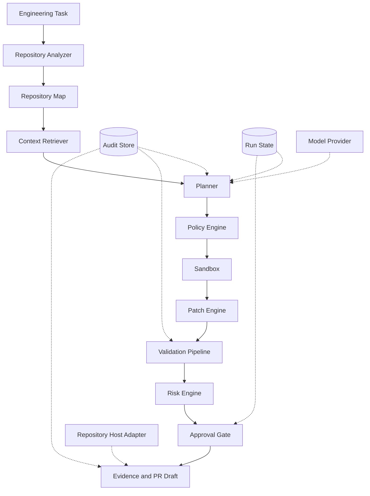

# PatchPilot

### Governed Autonomous Software Engineering Agent

PatchPilot analyzes software repositories, plans bounded code changes, executes them inside
controlled workspaces, validates patches with tests and static checks, scores risk, and produces
evidence-backed changes for human review.

PatchPilot is an original MIT-licensed Python project. It is a backend and CLI system, not a
chatbot or an automatic GitHub publisher. Its core works without an LLM, paid API, network
access, or GitHub write permission.

## What is implemented

- Commit-anchored Git repository intake, language and framework discovery, Python AST indexing,
  and a deterministic JavaScript/TypeScript fallback index.
- Explainable context ranking across paths, symbols, imports, tests, configuration, and manifests.
- Typed task analysis, plans, lifecycle states, provider interfaces, and a deterministic provider.
- Local copied-workspace execution plus an optional Docker adapter with network, capability,
  process, memory, CPU, filesystem, and timeout controls.
- Programmatic command and file policies, structured hash-checked patch transactions, ordered
  validation, bounded repair, deterministic risk scoring, patch-scoped approvals, and diff review.
- Secret-safe audit records, content-addressed evidence bundles, SQLite persistence, cancellation,
  metrics, a read-only repository host boundary, and PR draft generation.
- A Typer CLI, substantial tests, and five deterministic software-engineering evaluation scenarios.

## Architecture



The coordinator persists the plan before editing. Every command crosses the policy engine, edits
occur in a copied workspace, and publication is outside the autonomous core. See
[architecture](docs/architecture.md) for component and lifecycle details.

## Quick start

Requirements: Python 3.12+, Git, and [uv](https://docs.astral.sh/uv/). Node.js is needed only for
the TypeScript evaluation fixture. Docker is optional.

```console
git clone https://github.com/arees412/patchpilot-ai.git
cd patchpilot-ai
uv sync --extra dev
uv run patchpilot --help
```

Create a task file, then analyze a local Git repository:

```console
uv run patchpilot analyze ../target-repository --task task.md
uv run patchpilot plan RUN_ID
uv run patchpilot status RUN_ID
```

`analyze` prints the persisted run identifier. `run` accepts a JSON array of structured
`PatchFile` objects and applies it only to a copied workspace. Use `approve`, `reject`, `diff`,
and `evidence` for governed follow-up actions. The CLI does not push or merge.

## Deterministic demo

Run the complete offline evaluation:

```console
uv run patchpilot eval
```

The harness builds fresh local Git fixtures and reports each result without contacting a model or
external service. It covers a Python calculation bug, a TypeScript API change, a destructive
request denial, a dependency approval gate, and a bounded repair. These are transparent fixture
results, not SWE-bench scores or production benchmarks. Details are in
[evaluation](docs/evaluation.md).

## Security model

PatchPilot treats repository content, tasks, generated patches, and command output as untrusted.
Control is enforced in code through path confinement, command classification, copied workspaces,
timeouts, output caps, environment allowlists, redaction, scoped approvals, and disabled Git
publication methods.

The local adapter is for trusted fixtures and is not an operating-system security boundary. The
Docker adapter has stronger defaults, but PatchPilot does not guarantee that arbitrary third-party
repositories are safe to execute. Sandboxing is a defense layer, not proof that untrusted code is
harmless. Read the full [security model](docs/security.md) before executing repository scripts.

## Supported scope

| Area | Current support |
| --- | --- |
| Repository intake | Local Git working trees and generated fixture repositories |
| Code indexing | Python AST; deterministic JS/TS symbol/import fallback |
| Python validation | compileall, Ruff format/lint, mypy, pytest |
| JS/TS validation | declared npm typecheck/test scripts; Vitest targeting when detected |
| Persistence | Local SQLite |
| Providers | Deterministic provider; inert configuration boundary for OpenAI-compatible adapters |
| Sandbox | Copied local fixture adapter; optional Docker process adapter |
| Host integration | Read interfaces, fake CI adapter, and local PR draft generation |

Other languages can be inventoried by extension, but PatchPilot does not claim AST or runner
coverage for them.

## Current limitations

- The deterministic provider plans and governs supplied structured changes; it is not a general
  model-powered code generator.
- The JavaScript/TypeScript index uses a conservative parser fallback, not full semantic analysis.
- Docker availability and image provenance remain operator responsibilities.
- Local SQLite supports one-machine workflows, not distributed scheduling or high availability.
- Secret detection and diff review use high-confidence heuristics and are not complete analyzers.
- No API or frontend is included because the CLI demonstrates the current backend contract.
- Git checkout, push, merge, tags, releases, issue comments, and PR publication are intentionally
  outside the autonomous core.

## Development

See [development](docs/development.md), [security](docs/security.md),
[evaluation](docs/evaluation.md), and [decision records](docs/decisions.md). Architectural research
sources and the independent-implementation statement are in [REFERENCES.md](REFERENCES.md).

## License

MIT. See [LICENSE](LICENSE).
