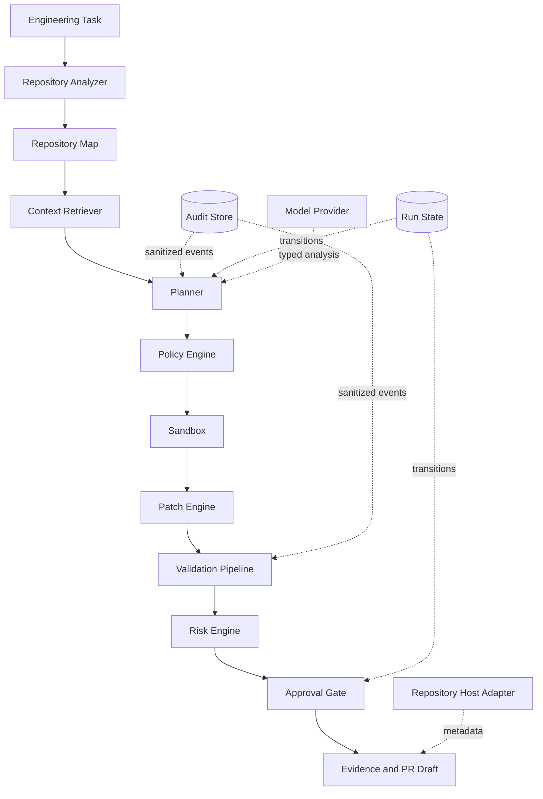
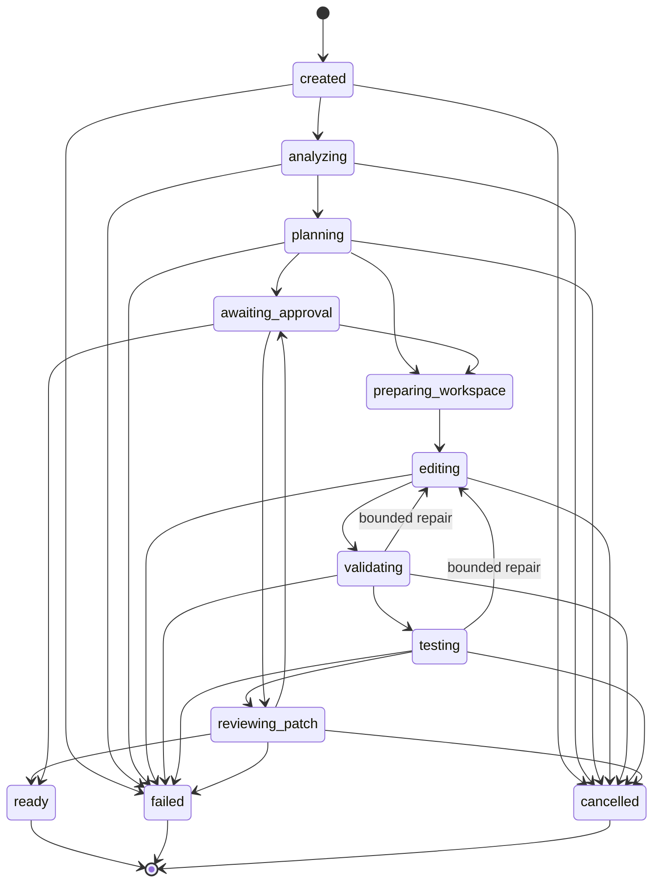

# Architecture

PatchPilot separates repository understanding, decision-making, execution, validation, and
publication boundaries. Typed immutable Pydantic models cross those boundaries. The deterministic
provider and fake repository host make the control plane testable without network access.

## Component flow

The repository analyzer anchors work to `git rev-parse HEAD` and builds a map of files, symbols,
imports, tests, manifests, configurations, frameworks, and likely entry points. Context retrieval
uses deterministic scoring with recorded reasons. The provider receives only typed task, map, and
context objects. A plan must be persisted before the coordinator prepares a workspace.

The patch engine accepts create, update, and explicitly enabled delete operations. Update and
delete operations include the expected SHA-256 of the base bytes. Application is transactional:
any write error restores the original files. Validation progresses through syntax, formatting,
lint, typing, targeted tests, broader tests, and diff review where supported.

## Lifecycle

`AgentStateMachine` rejects every transition not present in its explicit table. The SQLite store
records each accepted transition. Terminal states have no outbound transitions.

## Boundaries

- `AgentModelProvider` owns analysis and planning. The deterministic implementation is the only
  active provider needed by CI.
- `SandboxAdapter` owns command execution. The local adapter copies the repository; the Docker
  adapter constructs a hardened container invocation.
- `RepositoryHostAdapter` is read-oriented. PR creation is represented as a Markdown draft and is
  never published by the core.
- `SQLiteStore` owns resumable task, run, plan, approval, validation, audit, and evidence records.
- `GitSafety` exposes status, diff, and revision while refusing push, merge, force push, tags, and
  releases.

## Evidence and observability

Evidence payloads are recursively sanitized and hashed using canonical JSON. A bundle includes
the record hashes plus its own manifest hash. Metrics include phase duration, commands, tests,
repairs, file and line changes, validation failures, and provider metadata. They are operational
counters, not performance or cost claims.
